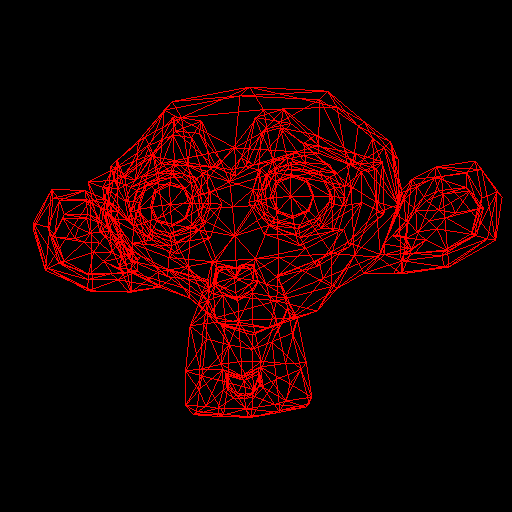

# meshviewer

A simple viewer of STL (STereoLithography or Standard Tessellation Language) and
OBJ meshes written in Haskell and modern OpenGL.

The program takes advantage of modern hardware by storing vertices' data and
performing matrix transformations entirely inside the high-performance GPU.

### Installation

``` sh
$ stack build
$ stack exec meshviewer sample/cube.stl
```

**NOTE**: currently, shader GLSL source files `vertex.glsl` and `fragment.glsl`
must reside in `./src` directory for the program to run.

### Controls

* Keyboard arrows -- rotate the model along X/Y axis
* `Home`/`End` -- rotate the mode along Z (depth) axe
* `PageUp`/`PageDown` -- increase/decrease model scale


### Notes
Some meshes are big and may not be fully visible until you tweak the scale with
`PageDown`.


